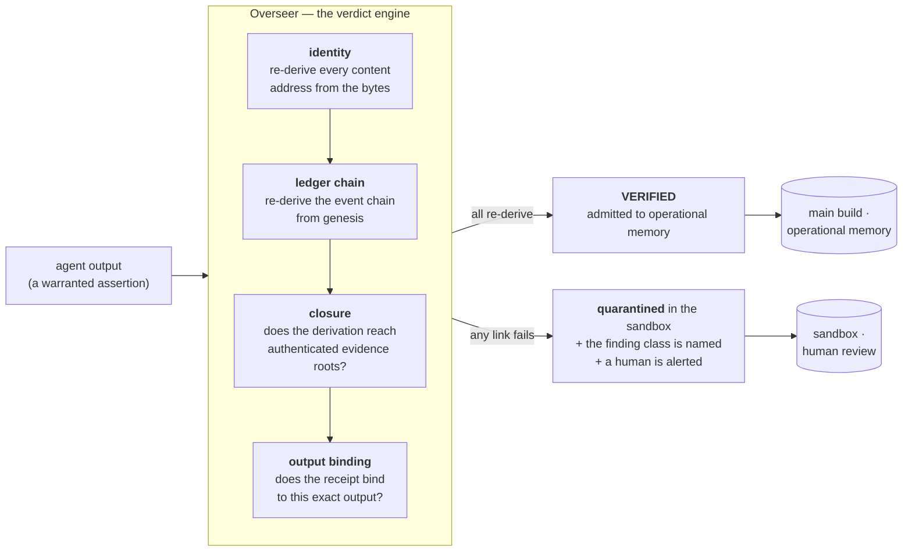

# Architecture

What TracePermit is, what it enforces, and — the part that matters most for
evaluating it — what it demonstrably does **not** do.

This document describes the demonstrated system and its measured evaluation.
The substrate specification, algorithms, and implementation source are withheld;
what is published is the interactive demonstration (`index.html`), the measured
results it reports, and this description of the design. Where a number here
comes from the research prototype rather than from the page you can run, it is
labelled.

---

## 1. The problem: one unsupported claim becomes everyone's premise

Real agent systems chain many models — extract, retrieve, analyse, draft,
summarise. The output of one stage is the input of the next. One unsupported
claim upstream silently becomes a premise downstream, and by the time anyone
notices, it is load-bearing in a dozen derived results.

Logging does not solve this. A log records *what happened*; it does not record
*what depended on what*, and it does not tell you whether a claim was
admissible when it was made. The measured consequence is stark: in the
controlled comparison below, **provenance logging without a gate blocked 0% of
attacks** — exactly as many as no substrate at all.

The record is not the control. The gate is the control.

## 2. The gate



The gate sits between every agent and operational memory. A claim that
reconstructs to evidence is admitted; a claim that does not is quarantined and
escalated. There is no "probably fine" verdict and no confidence score — the
audit either reconstructs the bytes or names what did not.

Every sentence a model generates is treated as a **warranted assertion** whose
full derivation is exportable as a graph: claim → derivations → independent
evidence roots (a PDF page, a CSV row, an email span). The trace panel in the
demo walks exactly that structure.

### Finding classes

When a verdict escalates, the finding names the class rather than reporting a
generic failure:

| Injected corruption | Outcome | Finding |
|---|---|---|
| fabricated value | blocked | `E_IDENTITY` |
| forged author | blocked | `E_LEDGER_CHAIN` |
| ledger rollback | blocked | `E_LEDGER_CHAIN` |
| evidence swap | blocked | `E_IDENTITY` |
| unsupported claim | blocked | no span |
| receipt forgery | blocked | `OUTPUT_BINDING` |

Omitting an *origin* is the honest exception, and section 5 explains why.

## 3. What the demo actually computes

`index.html` is a single self-contained page: no build step, no dependencies,
no network calls. The audit console runs **real SHA-256 in your browser via the
Web Crypto API** — edit a value in the evidence table and the verdict on the
right recomputes from the new bytes. Nothing is a lookup table and nothing is
faked.

CI enforces all four of those properties on every push
([`.github/workflows/ci.yml`](../.github/workflows/ci.yml)): no external
resource references, no network APIs, `crypto.subtle` present, and the page
parses. A repository about provenance should not ask to be taken on trust.

Five sections:

1. **Audit console** — corrupt the evidence and watch the verdict fail closed.
2. **Orchestration** — a multi-agent build where one agent is hallucinating;
   watch the unsupported output quarantine at the gate instead of reaching
   operational memory.
3. **Provenance trace** — expand a claim down to its independent evidence roots.
4. **Measured results** — the controlled comparison below.
5. **The boundary** — the negative results, in the same typeface as everything
   else.

## 4. What was measured

A controlled comparison on the research prototype: five admission layers
receive **identical generator output**, so only the governance layer varies and
the difference is causal. 240 cases, 180 attacks across six classes. Attack
success is the fraction admitted — lower is better. Wilson 95% intervals; zero
false alarms in every arm.

| Admission layer | Attack success |
|---|---|
| Citations only, no substrate | **100%** |
| Provenance logging, no gate | **100%** |
| Overseer admission gate | 33.3% |
| + truthful origin gateway | **0.6%** |
| + colluding gateway | 17.2% |

The control that matters is the second row. Record-keeping without a gate
blocks nothing at all; the protection comes from admission control, not from
the audit trail. Building the comparison so that the flattering conclusion
("we log provenance, so we're covered") could be *falsified* is the point of
including it.

Additional results from the prototype: **1100 of 1100 receipt mutations
rejected** across 11 tamper operators, and cross-language auditor agreement —
an independent Python implementation and the TypeScript implementation, sharing
no code — over a **75,113-assertion graph**.

## 5. The boundary

A verification system is only as trustworthy as its stated failure modes.

| | |
|---|---|
| **Enforced** | identity · ledger · closure · output binding · replay |
| **Conditional** | origin completeness — requires a truthful gateway |
| **Not claimed** | truth · authority · confidentiality · semantic support |

Three measured limits, each published on the page rather than in a footnote.

**Provenance is not semantic support.** On 14,289 human-annotated hallucination
spans (RAGTruth), structural grounding scored **balanced accuracy 0.53**.
Faithful paraphrase introduces tokens absent from the source in exactly the way
fabrication does, so byte-level grounding cannot separate them. Semantic
entailment is a layer *above* this substrate. A fabricated claim that cites a
real, unaltered, correctly-hashed internal document **passes this gate**, by
design and by measurement.

**A content address is not a secret.** Recovering a date of birth from its
published content id by dictionary attack took **26 ms**. Content addressing
gives integrity, not confidentiality; low-entropy evidence needs a keyed
commitment.

**Origin completeness is conditional, not guaranteed.** With a truthfully
reporting evidence gateway, omission attacks are caught. A *colluding* gateway —
one that lies about what it admitted — defeats the check. Attack success rises
from 0.6% to 17.2% in exactly that arm, and it is reported as a conditional
invariant rather than folded into the headline.

A cross-language canonicalization divergence at 2⁵³ was also found by the
project's own adversarial harness, disclosed, and repaired in a versioned
successor artifact rather than patched in place — the successor is a separate,
separately-verified artifact, so results attributed to the original are not
silently reattributed to the fix.

## 6. Verifying this release

The repository is its own worked example.

```bash
sha256sum -c SHA256SUMS      # every published byte re-derives
ots verify index.html.ots    # when these bytes existed, per Bitcoin
```

Full procedure, including signed-commit verification and the calendar-versus-
block-header distinction: [`../PROVENANCE.md`](../PROVENANCE.md).

A timestamp proves that **these exact bytes existed no later than the anchoring
block**. It does not establish authorship, originality, correctness, or that
the measured results are true, and it cannot prove the bytes did not exist
earlier. For a project whose subject is the difference between structural
verification and semantic support, that distinction is the whole point: this is
an integrity and ordering claim, not a truth claim — the same distinction
TracePermit makes about the claims it admits.

## 7. Scope

This is a capability demonstration. The in-browser panel runs standard SHA-256
only. The substrate specification, algorithms, and implementation source are
withheld. Results were measured on a research prototype and are reported as
such.

Related paper: *Admission Control for AI-Generated Documents: A
Content-Addressed Provenance Substrate with an Independent Overseer.*
